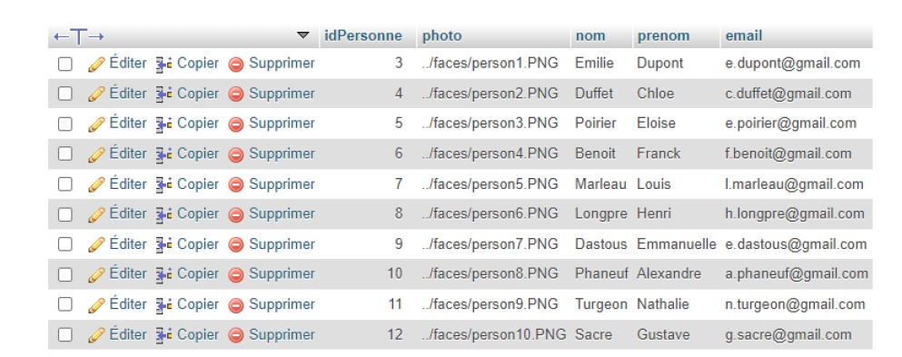
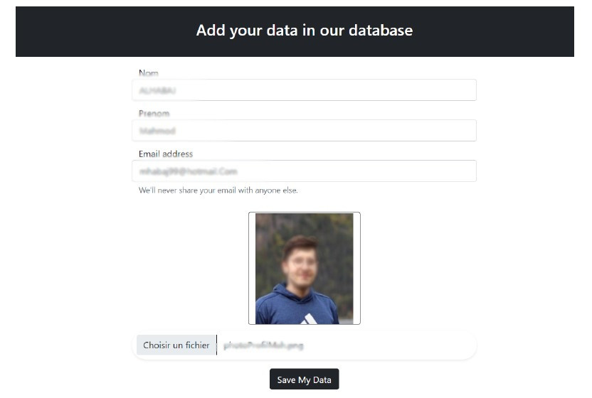
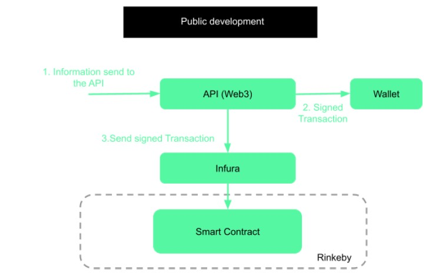

# Blockchain

- [sujet](Sujet%201.pdf)
- [rapport](LACLAVERIE_LE-CAIGNEC_MAGGOUH_AHLABAJ.pdf)

# Contributeurs
- Mahmoud Maggouh
- Nahoufal Ahlabaj
- Robin Le Caignec
- Pierre Laclaverie

# Contexte
L’objectif du projet est de créer une gestion de consentement privée et sécurisée
suite à une reconnaissance faciale en utilisant la blockchain.
Une fois une personne reconnue dans un flux vidéo, une demande de
consentement contenant ses informations personnelles lui sera envoyée en lui indiquant
qu’elle a été reconnue. Cette demande ainsi que la réponse du consentement de la
personne sera stockée dans la blockchain afin de la rendre immuable. De cette manière, si
une personne accepte ou refuse de donner son consentement sa réponse ne pourra pas être
modifiée, falsifiée par un intermédiaire.

# Base de données

# Interface d'ajout

L'interface d'ajout permet d'enregistrer une personne dans la base de données. Celle-ci peut être remplacée par un algorithme qui par exemple sillonne les réseaux sociaux à la recherche de ces informations

# Reconnaissance

Après avoir ajouté une personne dans la base de données, l'algorithme de reconnaissance d'images va apprendre les caractéristiques de son visage. Si une caméra filme le visage alors il sera identifié.
Ici voici ce que vois une webcam filaire tournée sur l'écran de l'ordinateur.

# Blockchain 

Nous utilisons une blockchain publique de développement pour une sécurité maximale. Et avons implémenté une API pour communiquer avec elle.

# Nota 

- Des informations plus détaillées sont dans le [rapport](LACLAVERIE_LE-CAIGNEC_MAGGOUH_AHLABAJ.pdf).
- Pour que le projet fonctionne, il faut rentrer de vrai adresses mails dans la base de donnees. Pour les besoins de la demo, une adresse mail personnelle a ete utilisée mais a été retirée du projet. De même, il faut completer le fichier [.env](BigBrother/blockchain/.env) avec les informations de **votre** blockchain. En effet, nous avons utilisé une blockchain qui nous appartenait mais ne voulons pas la partager.